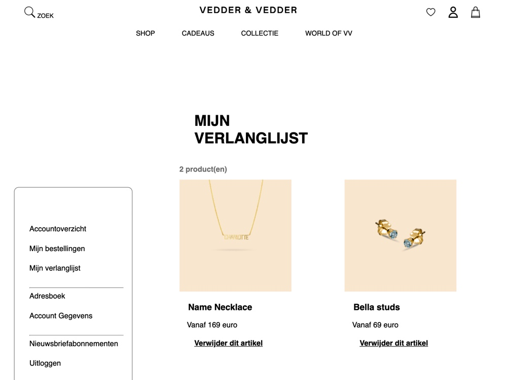

 Psr\Log\LoggerInterface

# Procesverslag
**Auteur:** -Amy van der Toorn-

Markdown cheat cheet: [Hulp bij het schrijven van Markdown](https://github.com/adam-p/markdown-here/wiki/Markdown-Cheatsheet). Nb. de standaardstructuur en de spartaanse opmaak zijn helemaal prima. Het gaat om de inhoud van je procesverslag. Besteedt de tijd voor pracht en praal aan je website.

## Bronnenlijst
1. https://www.bobdewebbouwer.com/ronde-hoeken-css-3/
2. https://www.vedder-vedder.com/nl/?gclid=Cj0KCQiAkuP9BRCkARIsAKGLE8VLjxiBg1fFRNmXtUWgLjyymK2_P0-voP7mo36BxLJt5WuAH6a9sHsaAq03EALw_wcB
3. https://www.w3schools.com/css/css_rwd_images.asp
4. https://grid.layoutit.com/
5. https://www.w3schools.com/css/tryit.asp?filename=tryresponsive_image_background1
6. https://www.w3schools.com/cssref/sel_first-of-type.asp
7. https://nl.pinterest.com/pin/500673683572853839/
8. https://codepen.io/shooft/pen/qBZPdGm
9. https://css-tricks.com/snippets/css/a-guide-to-flexbox/
10. https://www.w3.org/Style/Examples/007/center.nl.html
11. https://www.youtube.com/watch?v=2_E5uoiLCLY
12. https://css-tricks.com/pure-css-horizontal-scrolling/
13. https://www.youtube.com/watch?v=DEpF1nNz1l0

## Eindgesprek (week 7/8)

-dit ging goed & dit was lastig-

dit ging goed:
- In de laatste week kreeg ik mijn hamburger menu steeds meer onder controlen, helaas ging dat allemaal niet heel erg snel maar ik ben wel trots op mijzelf. Voor de rest ben ik gaan spelen met het responsive maken en voor mijn doen ging dat ook best goed.

- Javascript is mij gelukt, na het bekijken van veel filmpjes.

dit was lastig:
- Ik had in het begin van week 7 nog steeds een beetje moeite met het responsive maken van mijn navigatie/hamburger menu.
Ik heb van de studentassistent de tip gekregen om de huiswerk opdrachten opnieuw te bekijken. Dit heeft mij zeker geholpen!

- Daarnaast vond ik het responsive maken van mijn slider nog steeds erg moeilijk en daar heb ik tot het laatste moment problemen mee gehad. Gelukkig is dat mij wel uiteindelijk gelukt.

**Screenshot(s):**

-screenshot(s) van je eindresultaat-

Schermen voor de Iphone X:

Schermen voor responsive:

## Voortgang 3 (week 6)

-dit ging goed & dit was lastig-

Dit ging goed:
- Ik heb me deze week gefocusd op het responsive maken van mijn website. Ik heb veel filmpjes bekeken en notities gemaakt.
Ik begon deze week steeds meer te begrijpen hoe een responsive website werkt.

Dit was lastig:
- Ik ben begonnen met het responsive maken van mijn website, dit ging wel goed alleen duurde het wel lang voordat ik het eindelijk snapte.
- Ik heb nog wat onderzoek gedaan naar javascript maar daar liep ik ook nog mee vast. Hier wil ik me aankomende week mee bezig houden.

Overall:
- ik heb deze week niet onwijs veel tijd gehad om verder te kijken dan responsive. Ik wil me deze week weer meer gaan verdiepen in javascript en het maken van een hamburger menu.

## Voortgang 2 (week 5)

-same as voortgang 1-

-dit ging goed & dit was lastig-

dit ging goed:
- Ik had deze week we html af waardoor ik een goede basis had om mijn css codes aan toe te passen. Ik ging me nog niet perse focussen op het reponsive maken maar ik ging mij meer focussen op de vormgeving van de website.

dit was lastig:
- Na het kijken van een uitleg filmpje over een hamburger menu die 2 uur lang duurde was ik even de weg kwijt. Er kwam veel informatie in een keer op mij af. Ik moest alles even goed doornemen en het duurde lang voordat ik pas snapte hoe het een beetje werkte. Nu moest ik het ook nog eens in mijn eigen ontwerp toepassen. Dat ging helaas niet zonder moeite... Ik heb besloten om dit even te laten rusten en me te focussen op het responsive maken van mijn website.

## Voortgang 1 (week 3)

### Stand van zaken

-dit ging goed & dit was lastig-

Dit ging goed:
Ik begon voor mijn gevoel erg sterk aan mijn html en vervolgens ook aan mijn css. Het invoegen van afbeeldingen ging erg gemakkelijk en spelen met position ging ook erg goed.

- Opzet van html & css.
- Afbeeldingen invoegen.
- Het positioneren van afbeeldingen/knoppen/tekst.

Dit was lastig:
- Ik vind het onderwerp responsive nog best lastig, ik weet ook niet waar ik moet beginnen.
- Ik ben begonnen met het maken van een hamburger menu, alleen na 2 volle dagen hier aanzitten is het mij nog niet gelukt om het menu te fixen.
- Javascript vind ik ook nog erg lastig. Ik snap vaak niet hoe javascript nou echt werkt.
- Ik liep ook vast met het maken van een slider.

**Screenshot(s):**

-screenshot(s) van hoe ver je bent met korte uitleg-

Uitleg:
Ik ben bezig met de homepage van de website: Vedder & Vedder.

### Agenda voor meeting

-samen met je groepje opstellen-

Student 1 -Amy:
| Hoe maak ik op een overzichtelijke manier een goede slider?
| Hoe maak ik een goed werkende hamburger menu?
| Ik heb veel losse p’tjes en h1 t/m h6 als ik die wil bewerken in   css, klopt het dan dat ik allemaal id geef?
| Ik ben een webshop aan het namaken, maar die verandert wel bijna   elke week.. Wat moet ik daaraan doen?
| Responsive
| Ik heb een div gebruikt, is dat handig?

Student 2 -Ellen:
| Headings (h1 - h6), wanneer pas je welke toe?
| Gebruik afbeelding: hoe kan je ‘m ‘kaderen’?

Student 3 -Jasmijn:
| Op de originele website staat een video over de volle        schermbreedte, op de desktop lijkt dit een andere video te zijn, moet ik hier nu 2 aparte video elementen voor maken en de ene dus overflow: hidden; geven?
| Mag ik een div gebruiken voor mijn header? Door een div te gebruiken bespaar ik mezelf zo ongeveer 30+ regels css en dat lijkt mij dus wel overzichtelijker.
| Is het een probleem als ik pas later met de NAV begin, en mij voornu focus op hoe de website er in zijn geheel uit ziet, aangezien de NAV een hamburger wordt die uitklapt met JS.
| Transparante zwarte overlay over een afbeelding > voorbeeld?

Student 4 -Beyza:
| Hoe pas ik text-shadow toe en bepaal ik de waarden?
| Hoe zorg ik ervoor dat transform: skewY alleen toegepast wordt op   de tekst?

### Verslag van meeting

-na afloop snel uitkomsten vastleggen-

Wij hadden allemaal een beetje dezelfde vragen, het was daarom een erg nuttige meeting waar ik veel aan had. Na de meeting kon ik gelijk weer aan de slag en liep ik niet meer vast.

Wat heb ik geleerd?
- slider maken met display flex en overflow auto (x en y).
- ID is uniek.
-Afbeeldingen als achtergrond zetten in css om je wesbite responsive te maken.
- H zijn lijnen van een page.

## Breakdownschets (week 1)

-uitwerken voor de 1e werkgroep - eind van de eerste week-

## Intake (week 1)
-uitwerken voor de kick-off werkgroep - begin van de eerste week-

**Je startniveau:** -kies uit zwart, rood óf blauw-
rood

**Je focus:** -kies uit responsive óf surface plane-
allebei

**Je opdracht:** -link naar de website die je gaat namaken óf de naam van je eigen ontwerp-
Ik wil een website gaan namaken. De website heet Vedder & Vedder:
https://www.vedder-vedder.com/nl/

**Screenshot(s) van de eerste pagina (small screen):**

**Screenshot(s) van de tweede pagina (small screen):**

